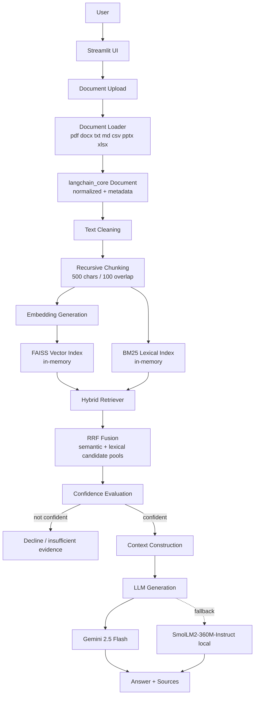

# AI Document Assistant

Upload documents, ask questions about them, get answers grounded in what those documents actually say.

This is a general-purpose RAG (Retrieval-Augmented Generation) app. It isn't tied to a particular subject
area — no domain logic is baked into the code. The PDF sitting in `data/documents/` is a test fixture that the
automated tests read; it isn't an example of what the app is for.

---

## Table of Contents

- [The problem](#the-problem)
- [Design goals](#design-goals)
- [Architecture](#architecture)
- [Supported formats](#supported-formats)
- [How a question gets answered](#how-a-question-gets-answered)
- [Retrieval](#retrieval)
- [Embeddings](#embeddings)
- [Answer generation](#answer-generation)
- [Measured results](#measured-results)
- [Limits](#limits)
- [A note on what "accuracy" means here](#a-note-on-what-accuracy-means-here)
- [Tech stack](#tech-stack)
- [Setup](#setup)
- [Configuration](#configuration)
- [Running it](#running-it)
- [Project layout](#project-layout)
- [Tests](#tests)
- [Security](#security)
- [Known limitations](#known-limitations)
- [What I'd do next](#what-id-do-next)

---

## The problem

Keyword search only works if you already know the wording. If you half-remember what a document said but not
the exact phrase, section, or page, you're stuck scrolling.

This app takes a different route: it pulls the passages most relevant to your question, hands them to a
language model as context, and asks for an answer. It's built for grounded Q&A over a set of documents you
supply yourself, kept in memory for the length of a session — working through a batch of reports, notes, or
reference material, say.

What it doesn't do:

- It doesn't promise correct answers. The model is told to say when the context doesn't cover something, and
  there's a confidence gate in front of it, but it's still a language model.
- It hasn't been load-tested. Don't assume it handles enterprise traffic or huge corpora.
- Nobody has measured how often the final answers are actually correct. The numbers later in this README are
  about retrieval, not about answer quality.

---

## Design goals

| Goal | How it's met |
|---|---|
| Format-agnostic ingestion | One loader turns all 7 formats into a single document type |
| Retrieval that doesn't care about format | The retriever never asks what kind of file a chunk came from |
| Grounded answers | A confidence gate decides whether to generate at all |
| Visible sources | Every answer comes back with the documents, pages, and chunks used |
| Works with no paid API | Local embedding and local generation fallbacks |
| Repeatable tests | Local embeddings and mocked generation — no network needed |

---

## Architecture



The knowledge base lives in memory and gets rebuilt from your uploads on demand. Nothing hits disk, and no
index survives the session.

---

## Supported formats

| Format | Extension | Notes |
|---|---|---|
| PDF | `.pdf` | Pulled with `pypdf` through LangChain's `PyPDFLoader`; one page each |
| Word | `.docx` | Paragraphs and tables; per-paragraph and per-table metadata |
| Text | `.txt` | Plain text |
| Markdown | `.md` | Plain text, whitespace tidied up |
| CSV | `.csv` | One document per data row via `pandas`; `row` metadata |
| PowerPoint | `.pptx` | One document per slide; `slide` metadata |
| Excel | `.xlsx` | One document per non-empty row, per worksheet; `sheet` + `row` metadata |

Everything becomes a `langchain_core.documents.Document` carrying:

- `source` — where the file came from
- `document_name` — the filename to show in the UI
- `file_type` — which format it was
- `document_id` — a stable ID derived from the filename
- Format-specific metadata (`page`, `slide`, `row`, `sheet`) where that makes sense
- `chunk_id` — assigned once chunking happens

Anything outside that list raises an error naming the file and the formats that are supported.

---

## How a question gets answered

| # | Stage | Module | What happens |
|---|---|---|---|
| 1 | Ingestion | `src/document_loader.py` | Work out the format, normalise to `Document` |
| 2 | Extraction | `src/document_loader.py` | Pull the actual text (pages, slides, rows, paragraphs) |
| 3 | Cleaning | `src/text_splitter.py` | Fix up extraction artefacts, collapse runs of whitespace |
| 4 | Chunking | `src/text_splitter.py` | Recursive split, 500 chars with 100 overlap; tags each `chunk_id` |
| 5 | Embedding | `src/embeddings.py` | One vector per chunk, from one provider for the whole index |
| 6 | Indexing | `src/vector_stores.py` | FAISS `IndexFlatIP` over normalised vectors, BM25 index alongside |
| 7 | Semantic search | `src/hybrid_retriever.py` | FAISS inner-product search for top candidates |
| 8 | Lexical search | `src/hybrid_retriever.py` | BM25 over the same chunks |
| 9 | Fusion | `src/hybrid_retriever.py` | Reciprocal Rank Fusion merges the two rankings |
| 10 | Confidence | `src/hybrid_retriever.py` | Decide whether this evidence justifies an answer |
| 11 | Context | `src/rag_pipeline.py` | Assemble labelled blocks from the retrieved chunks |
| 12 | Generation | `src/rag_chain.py` | Prompted generation under strict grounding rules |
| 13 | Sources | `app.py` | Report document, page, and chunk for everything retrieved |

---

## Retrieval

Two rankings get computed, then merged.

**Semantic.** Embeddings are L2-normalised and stored in a FAISS `IndexFlatIP` index, so inner product acts
as cosine similarity.

**Lexical.** `rank_bm25.BM25Okapi` scores the same chunks. This catches exact matches embeddings tend to miss —
product names, acronyms, version numbers. Case and punctuation are normalised before scoring.

**Fusion.** The union of both candidate lists is reranked by Reciprocal Rank Fusion with a rank constant of
`60`. Worth being precise about what RRF does: it combines the *rankings* and leaves the original similarity
scores untouched.

**The confidence gate.** Before any generation happens, the retrieved evidence gets checked:

- Score thresholds: `min_semantic_score = 0.35`, `strong_semantic_score = 0.75`, `semantic_only_score = 0.60`
- How much of the query's terms actually appear in the retrieved text
- Question-type guards — `who`, `where`, and `when` questions need matching kinds of evidence
- A pay/salary guard, so a question about pay needs pay-specific evidence. This matches whole words, which is
  what stops "learning" being read as "earning"

If the gate says no, you get an insufficient-information message instead of an answer.

**Document scope.** If your question names one of the uploaded documents by name, only that document gets
searched. Otherwise everything does.

---

## Embeddings

One FAISS index, one embedding provider. Mixing providers would mean mixing vector spaces and dimensions, which
doesn't work.

| Role | Provider | Model | Dimensions |
|---|---|---|---|
| Primary | Google Gemini | `gemini-embedding-2` | 768 |
| Fallback | sentence-transformers | `all-MiniLM-L6-v2` | 384 |

The local model takes over when Gemini reports quota trouble (`429`, `RESOURCE_EXHAUSTED`, or a quota message).

Switching providers invalidates the index, because the two models produce different dimensions in different
spaces. So when a quota failure shows up mid-query, the pipeline switches to the local model, rebuilds the
whole index with local embeddings, and retries. A Gemini-built index is never searched with MiniLM vectors.

There's no claim here about which provider retrieves better — that comparison hasn't been run.

---

## Answer generation

| Role | Provider | Model |
|---|---|---|
| Primary | Google Gemini | `gemini-2.5-flash` (override with `GEMINI_MODEL`) |
| Fallback | Local HuggingFace | `HuggingFaceTB/SmolLM2-360M-Instruct` |

The prompt tells the model to use only the supplied context, to say when something isn't in there, and to keep
what's directly supported separate from what's merely related.

Fallback kicks in on quota and availability errors: `429`, `RESOURCE_EXHAUSTED`, `503`, `UNAVAILABLE`,
`SERVICE UNAVAILABLE`.

Be clear about what the fallback is for: staying available, not matching quality. SmolLM2-360M is a small model
and won't keep up with Gemini. One failed request doesn't permanently switch you over.

---

## Measured results

Every number below came out of this repo's own test suite. Nothing here is estimated or extrapolated.

### Retrieval and gating

From `test_retrieval_eval.py`, last verified run:

| Metric | Value |
|---|---|
| Queries evaluated | 26 |
| Answerable | 22 |
| Unanswerable | 4 |
| Recall@5 | **88.46%** |
| Hit@5 | **100.00%** |
| MRR | **0.8348** |
| Confidence classification accuracy | **92.31%** |
| True Positives (TP) | 20 |
| True Negatives (TN) | 4 |
| False Positives (FP) | 0 |
| False Negatives (FN) | 2 |

Under what conditions:

- Corpus was the bundled 7-page fixture PDF, which chunks down to 21 chunks
- Embeddings came from `all-MiniLM-L6-v2`, the local fallback at 384 dimensions, forced so runs are
  deterministic
- Repeated runs in a clean process give identical numbers

This ran against one document, so read it as a regression benchmark. It is not a general accuracy claim, and
notably it wasn't measured on the primary Gemini provider.

### Latency

Not measured. Nobody has put this under controlled conditions and recorded the results, so there are no
per-stage or end-to-end timings to report. `run_rag()` in `src/rag_chain.py` does time retrieval, context
assembly, and generation separately — the instrumentation exists, the benchmark hasn't been run.

### Resources

| Item | Value |
|---|---|
| Python | 3.12.x |
| Streamlit | 1.64.0 |
| Primary embedding model | `gemini-embedding-2` (768-dim) |
| Fallback embedding model | `all-MiniLM-L6-v2` (384-dim) |
| Primary generation model | `gemini-2.5-flash` |
| Fallback generation model | `SmolLM2-360M-Instruct` |
| Device handling | Uses CUDA when available, CPU otherwise |
| Benchmark corpus | 7 pages → 21 chunks |
| RAM / VRAM needed | Not measured |
| Index size on disk | N/A — in-memory, never persisted |

The local models download from Hugging Face the first time they're needed and cache after that. One-time
setup cost, not a per-request dependency.

---

## Limits

### Enforced in code

| Limit | What happens |
|---|---|
| Supported formats | The 7 above, nothing else — `Unsupported file type: <ext>` |
| Empty document | `No readable content found in <file>` |
| Corrupt file | Format-specific error, e.g. `Unable to read Excel workbook: <file>` |
| Missing filename | `Uploaded file must have a filename.` |
| Empty query | `Query cannot be empty.` |
| Empty text for embedding | `Text cannot be empty.` |
| Chunk overlap | Has to be smaller than chunk size |
| No documents | Pipeline raises `No documents were provided.` |

There's no limit on file count, file size, or total corpus size.

### What we actually know

- The whole test suite runs against a 7-page / 21-chunk corpus.
- Big PDFs, workbooks, and slide decks haven't been tried.
- Your corpus, both indexes, and the models all have to fit in memory.

### What we don't know

| Metric | Status |
|---|---|
| Documents per session | Not enforced, not benchmarked |
| Document size | Not enforced, not benchmarked |
| Total corpus size | Not enforced, not benchmarked |
| Chunk count | Not enforced, not benchmarked |
| Simultaneous users | Not load-tested |
| Concurrent queries | Not load-tested |
| Upload size | Not configured here — the Streamlit server default applies |

To be explicit: there is no "unlimited" claim anywhere in this project. The index is in-memory and per-session,
so what you can realistically throw at it comes down to available memory and whatever upload ceiling the
hosting process sets.

---

## A note on what "accuracy" means here

Three different things get called accuracy. They aren't interchangeable, and this README keeps them apart.

**Retrieval** — did the right passages come back? That's Recall@5, Hit@5, and MRR, measured above.

**Confidence classification** — did the gate correctly judge whether the evidence was enough? That's the
accuracy, TP/TN/FP/FN split. It scores a decision, not an answer.

**Generation quality** — is the answer actually right and properly grounded? Unmeasured. Nobody has benchmarked
end-to-end answer correctness.

So there's no single "RAG accuracy" figure here, because nobody has calculated one. Averaging retrieval and
gating numbers into one accuracy percentage would overstate what's actually known.

### How the evaluation works

`test_retrieval_eval.py` runs a fixed, labelled query set against the fixture document. No network, fully
deterministic.

For each query it captures retrieved chunk IDs in rank order, then computes:

- **Recall@5** — how much of the expected relevant material landed in the top 5, micro-averaged across
  answerable queries
- **Hit@5** — share of answerable queries with at least one expected chunk in the top 5
- **MRR** — mean reciprocal rank of the first relevant chunk, `1/rank`. Queries with nothing relevant in the top
  5 score `0`
- **Confidence classification** — whether the gate's call matched whether the query was actually answerable,
  tallied as TP/TN/FP/FN

Queries fall into factual, conceptual, cross-section, paraphrased, and unanswerable groups. The unanswerable
group is the useful one — it's there to catch false positives, the case where the system answers something the
document never said.

Worth keeping in mind: one document, 26 queries, measured on the fallback embedding model. It's a guard against
regressions. It isn't a claim that the system is 88% accurate, because that isn't what it measures.

---

## Tech stack

| Layer | Technology | Version (pinned) |
|---|---|---|
| Language | Python | 3.12.x |
| UI | Streamlit | 1.64.0 |
| RAG framework | LangChain Core | 1.6.6 |
| Document loaders | LangChain Community | 0.4.2 |
| Text splitting | LangChain Text Splitters | 1.1.2 |
| Vector search | FAISS (`faiss-cpu`) | 1.15.1 |
| Lexical search | Rank BM25 | 0.2.2 |
| Embeddings (primary) | Google Gemini (`google-genai`) | 2.26.0 |
| Embeddings (fallback) | sentence-transformers | 6.1.0 |
| Local generation | PyTorch / Transformers | 2.14.1 / 5.18.0 |
| Tables | pandas | 3.0.6 |
| Excel | openpyxl | 3.1.5 |
| Word | python-docx | 1.2.0 |
| PowerPoint | python-pptx | 1.0.2 |
| PDF | pypdf | 6.19.0 |
| Config | python-dotenv | 1.2.4 |
| Numerics | numpy | 2.5.3 |

Reciprocal Rank Fusion is implemented directly in `src/hybrid_retriever.py` — not a third-party dependency.

---

## Setup

You'll need Python 3.12.x and `pip`. A Gemini API key is optional.

```bash
git clone <repository-url>
cd AI-Assistant

python -m venv .venv
source .venv/bin/activate          # Windows: .venv\Scripts\activate

pip install --upgrade pip
pip install -r requirements.txt
```

Every dependency is pinned, transitive ones included.

On first run Hugging Face will download the local fallback models (`all-MiniLM-L6-v2`, plus
`SmolLM2-360M-Instruct` if the generation fallback ever triggers) and cache them.

Quick check that the install works:

```bash
python test_document_formats.py
```

---

## Configuration

Environment variables, optionally through a `.env` file in the project root.

| Variable | Required | Default | Purpose |
|---|---|---|---|
| `GEMINI_API_KEY` | For Gemini providers | — | Credential for Gemini embeddings and generation |
| `LLM_PROVIDER` | No | `gemini` with a key, else `local` | Pick the provider explicitly |
| `GEMINI_MODEL` | No | `gemini-2.5-flash` | Override the generation model |

A few things that trip people up:

- `.env` is in `.gitignore`. Never commit it.
- Importing the Gemini integration doesn't need a key — the client is built lazily on first use, so local-only
  operation works with no credentials at all.
- Setting `LLM_PROVIDER=gemini` with no key fails at startup with a clear error, rather than blowing up later.

---

## Running it

```bash
source .venv/bin/activate
streamlit run app.py
```

Opens in a browser, usually `http://localhost:8501`.

1. Upload one or more documents — multiple selection works.
2. Build the knowledge base.
3. Ask questions. Answers come back with sources.

The knowledge base lives in Streamlit session state. It's rebuilt from your uploads and gone when the session
ends or you reset it.

No API key? Fine. Build the knowledge base as normal and the pipeline drops to local embeddings.

---

## Project layout

```
AI-Assistant/
├── app.py                        # Streamlit UI: upload, build, query, sources
├── requirements.txt              # Fully pinned dependencies
├── README.md
├── .env                          # Local secrets (git-ignored, never commit)
├── data/
│   └── documents/                # Test fixtures, used only by the test suite
├── src/
│   ├── __init__.py
│   ├── config.py                 # Environment configuration
│   ├── document_loader.py        # Format routing and text extraction
│   ├── text_splitter.py          # Cleaning and recursive chunking
│   ├── embeddings.py             # Embedding provider with local fallback
│   ├── gemini_client.py          # Lazy Gemini client: generation + embeddings
│   ├── local_llm.py              # Local HuggingFace generation fallback
│   ├── vector_stores.py          # FAISS + BM25 store
│   ├── hybrid_retriever.py       # Hybrid retrieval, RRF, confidence gate
│   ├── rag_chain.py              # Prompting and generation fallback
│   ├── rag_pipeline.py           # End-to-end orchestration
│   ├── document_manager.py       # Unused legacy scaffold (see below)
│   ├── prompts.py                # Unused placeholder (empty)
│   └── retriever.py              # Unused placeholder (empty)
└── test_*.py                     # Executable test and evaluation scripts
```

`document_manager.py`, `prompts.py`, and `retriever.py` are not in the active pipeline. The first is a
half-finished scaffold — PDF-only, raises `NotImplementedError`. The other two are empty files. Nothing imports
any of them.

One implementation detail worth knowing about: `src/hybrid_retriever.py` has a debug `print()` block in the
confidence gate that writes to stdout on every retrieval. Harmless, but it makes test output noisy.

---

## Tests

Standalone executable scripts — no pytest. Each runs with `python test_<name>.py` and exits non-zero when it
fails.

### Last full run

All 15 passed:

| Script | Area | Result |
|---|---|---|
| `test_document_formats.py` | Format tests | PASS |
| `test_document_loader.py` | Unit — loader | PASS |
| `test_uploaded_document.py` | Unit — upload path | PASS |
| `test_document_scope.py` | Unit — document scoping | PASS |
| `test_text_splitter.py` | Unit — cleaning/chunking | PASS |
| `test_embeddings.py` | Unit — embeddings | PASS |
| `test_gemini.py` | Unit — Gemini lazy initialisation | PASS |
| `test_rag_chain.py` | Component — RAG chain contract | PASS |
| `test_rag.py` | Component — RAG chain end-to-end | PASS |
| `test_hybrid_retriever.py` | Component — retrieval, RRF, gating | PASS |
| `test_retrieval.py` | Integration — index and search | PASS |
| `test_pipeline.py` | Integration — full pipeline | PASS |
| `test_embedding_fallback.py` | Fallback | PASS |
| `test_generation_fallback.py` | Fallback | PASS |
| `test_retrieval_eval.py` | Retrieval evaluation | PASS |

### What they cover

- **Formats** — all 7, with XLSX getting the most attention: multiple worksheets, true worksheet row numbers,
  blank rows, blank and `Unnamed: N` headers, collision-safe column names, value normalisation, empty workbooks,
  corrupt workbooks, and Streamlit-style upload objects.
- **Fallbacks** — Gemini quota exhaustion and 503/unavailable paths for both embedding and generation.
- **Contracts** — the retrieval result shape and the `(answer, provider)` generation return.
- **Regressions** — retrieval, pipeline, chunking, embeddings, loader, scope, and formats.

### How they're built

- **Core suites need no network.** Local embeddings, mocked generation.
- **Nothing blocks on input.** No test calls `input()`.
- **Deterministic.** Local embeddings, no sampling. Same result every run.
- **No coverage measurement** has been done, so this README quotes no coverage percentage.

Run the lot:

```bash
for t in test_*.py; do
    echo "== $t"
    python "$t" || echo "FAILED: $t"
done
```

Or just reproduce the metrics above:

```bash
python test_retrieval_eval.py
```

---

## Security

**Secrets**

- Keys come from the environment via `.env`. Nothing is hard-coded.
- `.env` and `.env.*` are in `.gitignore` and must not be committed.
- API keys never appear in error messages. There's a test covering this.

**Uploaded files are untrusted input**

- Format routing is allow-list based; anything else is rejected explicitly.
- Filenames are used as display metadata only — never executed, never eval'd, never used to build shell
  commands or paths outside the loader.
- Extracted text goes to the model as data inside a delimited context block. It's never executed or treated as
  code.
- Extraction leans on established libraries (`pypdf`, `python-docx`, `python-pptx`, `openpyxl`) rather than
  hand-rolled parsers.

**Gaps you should know about**

- **No authentication or authorisation.** Anyone who can reach the Streamlit server can query their own
  session's knowledge base. Don't put this on an untrusted network as-is.
- No multi-tenancy or per-user isolation beyond Streamlit session state.
- No audit log of queries or answers.
- `.streamlit/` is git-ignored. If you add server config, review it before deploying.

---

## Known limitations

1. **Source display assumes pages.** The UI shows document name plus page number. CSV, XLSX, and PPTX carry
   `row` or `slide` metadata instead of `page`, so the page shows as "Unknown" — even though that metadata is
   sitting right there in the document. Format-aware source display isn't built yet.
2. **Debug output in the confidence gate.** A `[CONFIDENCE DEBUG]` block prints on every retrieval
   (`src/hybrid_retriever.py`).
3. **No OCR.** Scanned or image-only PDFs give back almost no text and will retrieve badly. Text extraction
   only.
4. **Nothing persists.** The index rebuilds from uploads every session and is never saved, so there's no reuse
   across restarts.
5. **Retrieval benchmarks are narrow.** One fixture document, 26 queries, local fallback embeddings.
6. **Performance is unmeasured.** No latency, memory, or load figures — see
   [Measured results](#measured-results).
7. **Not load-tested.** Behaviour under many users or large corpora is unknown.
8. **Leftover scaffold files.** `document_manager.py`, `prompts.py`, and `retriever.py` are still in the tree,
   unused.
9. **No coverage measurement.**

---

## What I'd do next

Roughly in priority order. None of this is implemented.

**Correctness and transparency**

- Format-aware source attribution so XLSX rows, CSV rows, PPTX slides, and PDF pages all display properly.
- Content-based document IDs, so two different files that happen to share a filename don't get conflated
  (`document_id` currently derives from the name).
- Drop the debug `print()` from the confidence gate.
- Delete or finish the scaffold modules.
- Move to pytest and measure coverage.

**Retrieval quality**

- Grow the evaluation set past a single document, and measure the primary Gemini embeddings too, not just the
  fallback.
- Chase the remaining two false negatives with data before touching any threshold.
- Maybe re-rank retrieved chunks, and try parent/child chunking for cleaner context.

**Capability**

- OCR for scanned PDFs and images, without regressing normal PDF handling.
- Incremental indexing so adding a document doesn't mean a full rebuild.
- Persisted indexes, rebuilt when the provider changes.
- Streaming answers.

**Operations**

- Real latency and memory benchmarks.
- Auth and per-user isolation before this goes on a network.
- Structured logging and light observability.
- Containerisation, once there's a deployment target to aim at.

---

## License

None set. Add one before publishing this anywhere public.